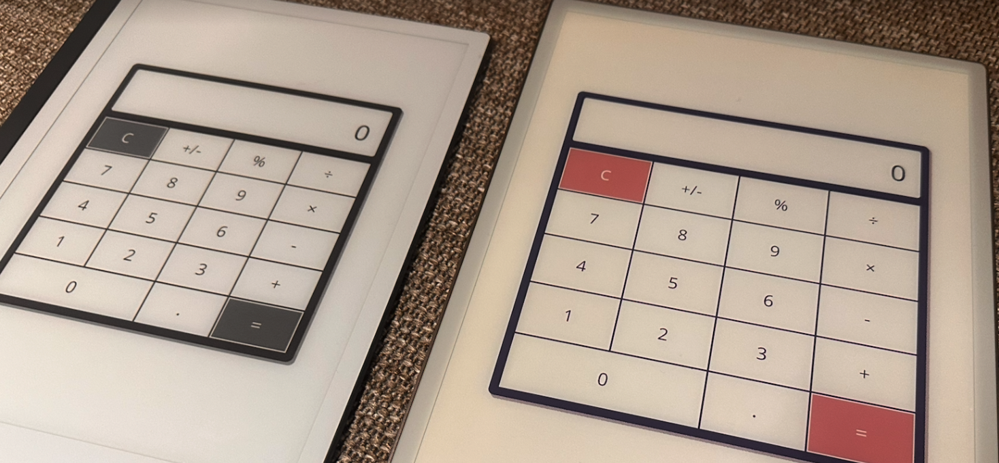

# reMarkable Developer Examples

This repository contains a few code examples that demonstrate how you can use
our [SDK](https://developer.remarkable.com/documentation/sdk)  to build
Qt Quick Applications.

- `hello_remarkable`
- `calculator`

Detailed instructions on how to set up your reMarkable for development and
build these examples can be found at the [reMarkable Developer Portal](https://developer.remarkable.com).

> [!IMPORTANT]
> Please note that you will be solely responsible for any changes or modifications
> you make to our software, including by using Developer Mode. We reserve the right
> to not provide support to software that has been subject to such changes or
> modifications. Errors or defects resulting from changes or modifications made by
> you will not be covered by our Limited Warranty or Protection Plan, or any legal
> warranty you might have (to the extent permitted under applicable law).
> reMarkable disclaims all liability in that regard.
